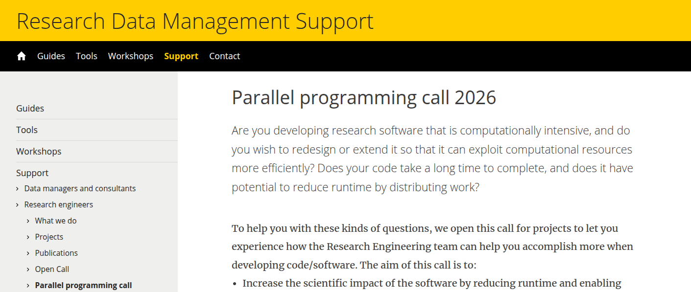

--- 
format: 
  revealjs:
    margin: 0
    theme: themes/uu.scss
    logo: images/UU_logo_2021_EN_RGB.png
    footer: "UDCC"
---

# Welcome! {data-background-color="#FFCD00"}

## HPC Spring School @ UU

::: {.theme-section-large}

- SURF
- EuroCC Netherlands
- Netherlands eScienceCenter
- UU Digital Competence Center
- Research Engineering team @ UU

:::

## HPC Spring School @ UU

::: {.theme-section}

- Primers: Git and Bash
- Supercomputing 1, 2, and 3
- SURF Research cloud: Introduction and Advanced
- Parallel and distributed computing with Python
- GPU computing

:::

## Overview of systems

::: {.theme-section}

- \>20 'HPC' systems in Utrecht
  * Utrecht Bioinformatics Center (UBC)
  * Faculty systems (Gemini, Eejit, etc)
- National supercomputer Snellius 
- SURF Research cloud
- European supercomputer LUMI (#8 in the world)

:::

## Getting started

::: {.theme-section}

- Contact support team
  * Faculty IT
  * UU HPC consultancy team
  * UBC support team
  * Surf servicedesk

:::

---

::: {.r-stack}

{.absolute bottom=20 right=100 width="300" height="300"}
:::

## Schedule today

::: {.theme-section}

| Time | Chapter |
|---|---|
| 9:30 | Bash, navigation, editing files |
| 11:00	| Coffee break |
| 12:30 | Scripts, filters, SSH/SCP |
: {.striped}

:::

# {data-background-color="#FFCD00"}

## Thank you for your participation!

::: {.theme-section}
:::: {.columns}

::: {.column width="40%"}
- [SURF](https://www.surf.nl/en)
- [EuroCC Netherlands](https://eurocc-netherlands.nl/)
- [UDCC](https://www.uu.nl/en/research/digital-competence-center)
- [Research Engineering team @ UU](https://www.uu.nl/en/research/research-data-management/tools/software-and-computing/high-performance-and-cloud-computing)
:::

::: {.column width="60%"}
Find these slides including hyperlinks here:

:::

::::

:::

## Survey

::: {.theme-section}

Please fill out the survey for this workshop:

:::

